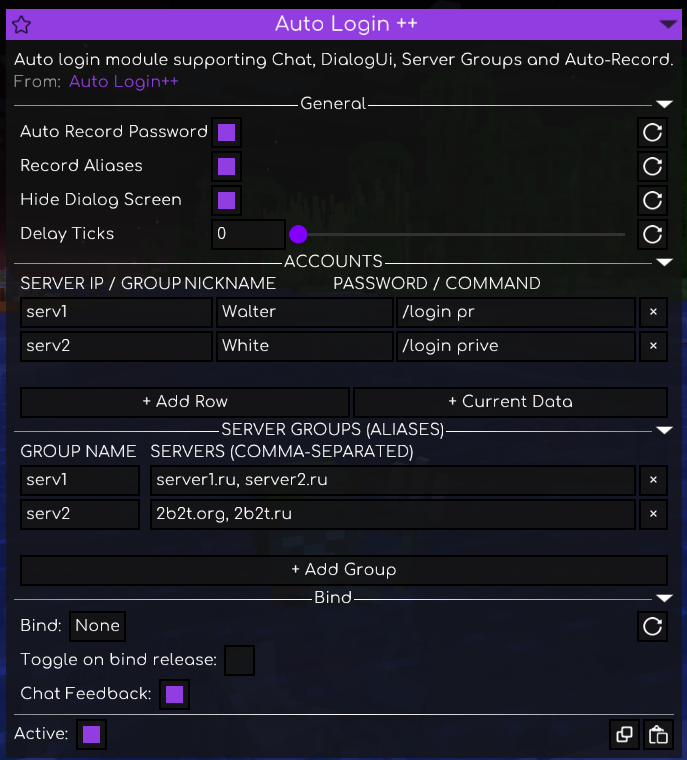

# Auto Login++

[](https://fabricmc.net/)
[](https://fabricmc.net/)
[](https://meteorclient.com/)

[🇷🇺 Русский](#русский) | [🇬🇧 English](#english)

---

## Русский

**Auto Login++** — аддон для [Meteor Client](https://meteorclient.com/) (Minecraft 1.21.11), добавляющий автоматический вход на сервера как обычным способом через чат (`/l`, `/login`), так и через Dialog Ui.

### Полезные функции

1. **Поддержка авторизации через DialogUi (Minecraft 1.21.7+)**:
   - Авторизация через интерактивные диалоговые окна на серверах версий 1.21.7+.
2. **Автозапись паролей (Auto Record Password)**:
   - Автоматическая запись паролей при первой регистрации или при логине на сервер. Т.е. вы просто включаете модуль, входите на сервер и модуль сохраняет ваш пароль, ник и сервер, и в следующий раз пароль автоматически введётся.
   - Защита от записи неверного пароля: пароль сохраняется только после успешного входа в мир.
3. **Алиасы и группы серверов (Server Groups / Aliases)**:
   - Возможность создавать алиасы серверов и указывать их вместо самих серверов. Полезно, когда у одного сервера несколько точек входа.
   - При включённой функции **«Record Aliases»** автозапись паролей сразу записывает алиас группы, а не сам сервер.
4. **Скрытие диалогового окна (Hide Dialog Screen)**:
   - Возможность скрыть всплывающее диалоговое окно авторизации при входе.
5. **Настройка задержки (Delay Ticks)**:
   - Регулируемая задержка перед отправкой команд или пакетов авторизации.

<p align="center">
  
</p>

### Установка

1. Убедитесь, что у вас установлены **Fabric Loader** (0.19+) и **Meteor Client** для **Minecraft 1.21.11**.
2. Скачайте последнюю версию аддона со страницы [Releases](https://github.com/pepember/auto-login-plus-plus/releases).
3. Поместите `.jar` файл в папку `.minecraft/mods`.
4. Запустите игру, откройте меню Meteor Client (по умолчанию `Правый Shift`), перейдите в категорию `Misc` и активируйте **Auto Login++**.

### Сборка из исходников

Требования:
- **JDK 21** или новее
- Git

Команды сборки:
```bash
# Клонировать репозиторий
git clone https://github.com/pepember/auto-login-plus-plus.git
cd auto-login-plus-plus

# Сборка на Windows:
.\gradlew.bat build

# Сборка на Linux / macOS:
./gradlew build
```
Готовый файл мода появится по пути: `build/libs/auto-login-plus-plus-1.0.0.jar`.

---

## English

**Auto Login++** is an advanced [Meteor Client](https://meteorclient.com/) addon for Minecraft 1.21.11 that automatically logs you into servers via traditional chat commands (`/l`, `/login`) as well as Dialog Ui.

### Features

1. **DialogUi Authentication Support (Minecraft 1.21.7+)**:
   - Authentication via interactive dialog screens on 1.21.7+ servers.
2. **Auto Record Password**:
   - Automatically records passwords upon initial registration or login. Simply enable the module and join the server — it saves your password, username, and server, and automatically logs you in on your next visit.
   - Wrong password protection: credentials are saved only after successfully joining the world.
3. **Server Groups & Aliases**:
   - Create server aliases and use them instead of raw server addresses. Useful when a single server has multiple entry points.
   - When **"Record Aliases"** is enabled, passwords are automatically assigned to the group alias rather than the specific server.
4. **Hide Dialog Screen**:
   - Cleanly hides intrusive authentication dialog screens when connecting.
5. **Customizable Delay (Delay Ticks)**:
   - Adjustable tick delay before sending authentication packets or chat commands.

<p align="center">
  
</p>

### Installation

1. Make sure you have **Fabric Loader** (0.19+) and **Meteor Client** installed for **Minecraft 1.21.11**.
2. Download the latest release from the [Releases](https://github.com/pepember/auto-login-plus-plus/releases) tab.
3. Place the `.jar` file into your `.minecraft/mods` folder.
4. Launch Minecraft, open Meteor ClickGUI (`Right Shift` by default), navigate to `Misc`, and enable **Auto Login++**.

### Building from Source

Requirements:
- **JDK 21** or newer
- Git

```bash
# Clone the repository
git clone https://github.com/pepember/auto-login-plus-plus.git
cd auto-login-plus-plus

# Build with Gradle Wrapper
# On Windows:
.\gradlew.bat build

# On Linux / macOS:
./gradlew build
```

The compiled jar will be located in `build/libs/auto-login-plus-plus-1.0.0.jar`.

---

## Credits

- [SindiAddon](https://github.com/RegalManiac/SindiAddon)

## Author

- **pepember** ([GitHub](https://github.com/pepember))
- gemini 3.8 flash
